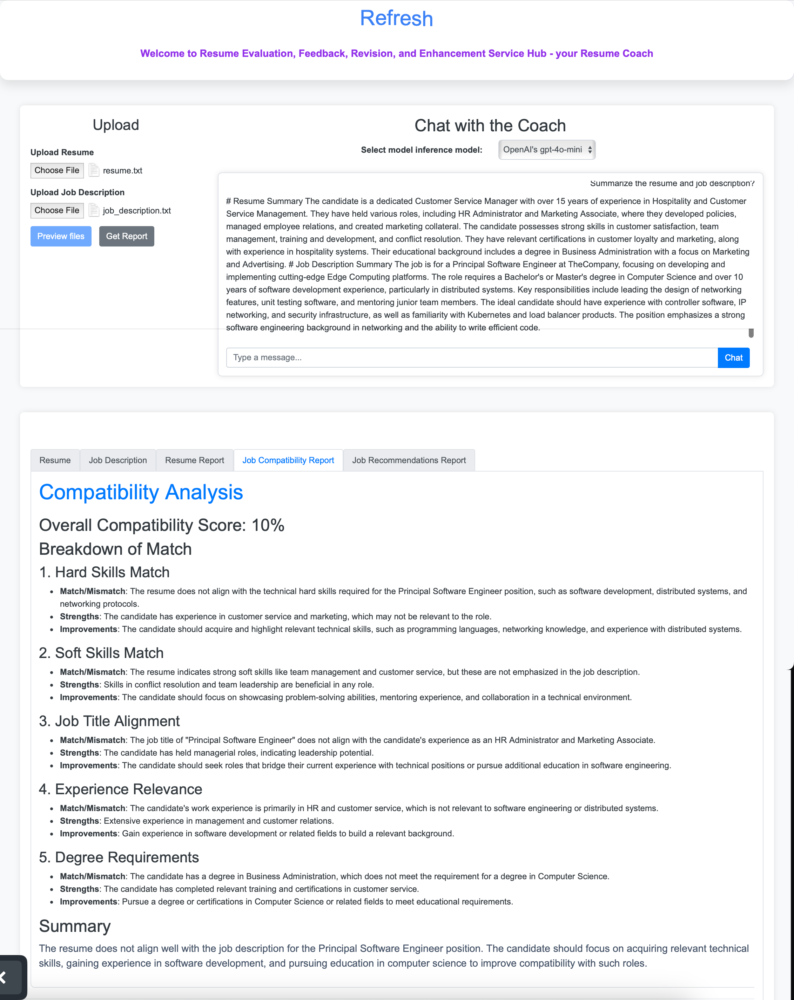
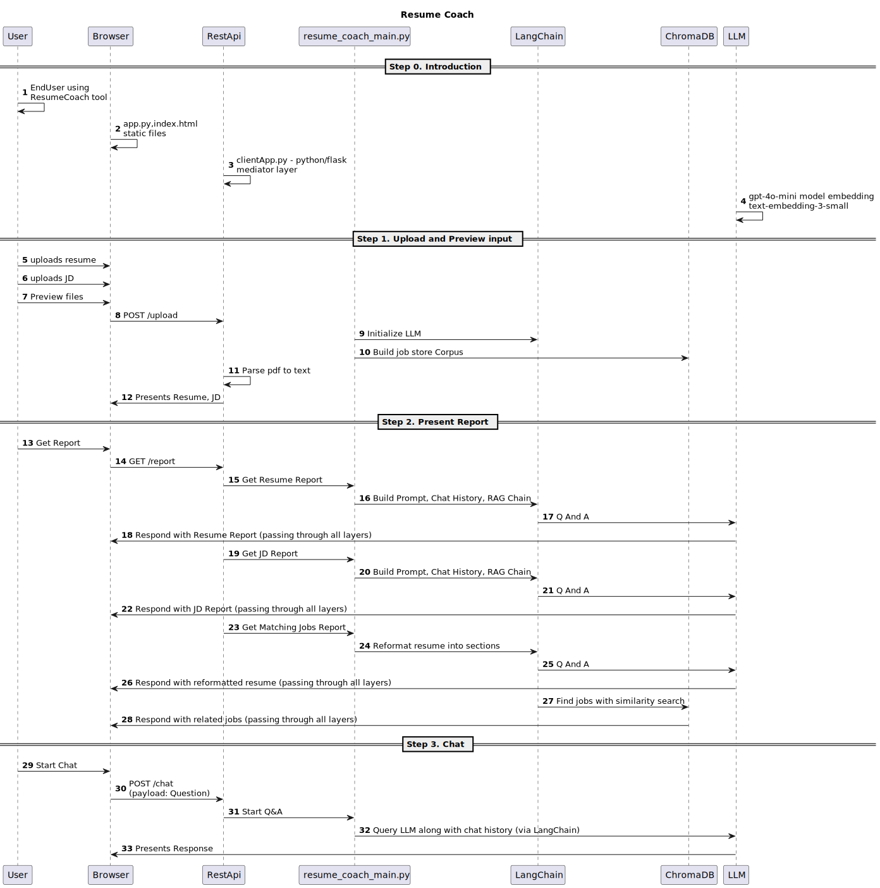

# Resume AI Coach

Project Name: **REFRESH** i.e Resume Evaluation, Feedback, Revision, and Enhancement Service Hub

## 1. Getting started
### 1.1 How to run

To run the demo, you can use either of the following URLs

1. Either https://52.24.126.62/refresh/
  - This VM is always running
  - OpenAI's chatgpt should always work
  - Selecting Meta's llama3.2 LLM model will require the below instance to be run
 
2. Or http://54.81.163.166:8000/ (part of IK's cloudlabs - ik_mlsuoct23cohort_g15)
 - As this VM requires a lot of credits, this is in stopped state and requires coordination with the team members
 - This VM instance has both the frontend (as above) and in addition hosts the Meta's llama3.2 locally
 - Details of the VM is given below in case IK has the permissions to start / stop

| **Instance ID**  | Instance | Zone | Public DNS | **Public IPv4** | Security | Platform |User |
| ---------------- |  ------------- | ------------------------ | ----------------- | -------------------------- | ------------------- | ---------- | ------------- | 
| i-0ff3cf59a18f3c669 |  g4dn. xlarge   | us-east-1f | ec2-54-81-163-166.compute-1. amazonaws.com | 54.81.163.166 | launch-wizard-1 | Linux | arn:aws:sts:: 099288422067: federated-user/ ik_mlsuoct23cohort_g15 |

### 1.2 Screenshot & Demo

The screenshot below shows the UI screen and gives you an idea of how to use




Demo (Video Recording)

[](https://drive.google.com/file/d/19_UFv3ONZTgd9rqNMWHpGvnV3vRGSWJZ/)


### 1.3 How to use
1. Select the "Choose File" button to upload Resume. Resume can be plain text or a pdf
2. Next select the "Choose File" button to upload a job description. The job description can be plain text or a pdf
3. Click "Preview files" to see the resume and job description in the bottom panel
4. By default, the inference model is OpenAI. If the 2nd instance is running, you can also select the Meta's llama3.2 model
5. Click on the "Get Report" button. After a few seconds, you will be able to see the following reports
  - Resume Report
  - Job Compatibility Report
  - Job Recommendations Report
6. Once the "Get Report" is completed, you can use the "Chat" button to ask more questions about the resume or job description or anything related


## 2. Feature Set 

### 2.1 Preview Resume/CV
 - Preview the resume contents
   - If resume is in pdf format, parse the resume

### 2.2 Preview Job Description
 - Preview the Job Description
   - If Job Description is in pdf format, parse the document

### 2.3 Resume Report
 - Assess the resume and provide qualitative feedback - point out anything missing and suggest improvements in the following components
    1. Contact Information
    2. Resume Summary
    3. Education
    4. Work Experience
    5. Skills Section
    6. Awards and Certifications
    7. Formatting
    8. Overall Customization

### 2.4 Job Compatibility Report
  - Provide an overall compatibity score of the Resume with the Job Description
  - Provide specific feedback on the following with respect to how well they match, relevant strengths in the resume and suggest improvements if necessary
    1. Hard Skills
    2. Soft Skills
    3. Job Title Alignment
    4. Experience Relevance
    5. Degree Requirements


### 2.5 Job Recommendations Report
  - Provides other matching jobs for the given resume from a corpus of available jobs. Additional details of this is at [job_recommender Architecture](docs/job_recommender_arc.md#job_recommender-architecture)


### 2.6 Chat with Coach 
  - Ability to chat on anything the user wants while maintaining the context of the resume and job description

## 3. Architecture

High-level [architecture diagram](docs/REFRESH_HighLevelArc.md#project-architecture)

### 3.1 EDA and Data Preparation

  - The inspiration for the UI came from https://skillsyncer.com/scans/sample
  - As part of EDA, We analyzed key features such as job title, location, company, job description, posting data and handled missing values
  - As part of the job recommendation, we needed a dataset of existing jobs. We used LinkedIn job postings for 2023 and 2024 from Kaggle (https://www.kaggle.com/datasets/arshkon/linkedin-job-postings/data)

### 3.2 Model and Hyperparameter Fine Tuning

  - Model Temperature: During the job recommendation retrieval process, we used a model temperature of 0 for consistent results. When we changed the temperature, we observed the job recommendations to be inconsistent.
  - TODO: Similarity Search

#### 3.2.1 Model selection

A comparison table between **GPT-4o-Mini** (a lightweight GPT-4o variant) and **LLaMA 3.2 3B** (a light weight model of llama 3), running locally via **Ollama** on an **NVIDIA H100 GPU on AWS**, considering aspects like performance, privacy, and accuracy:

| Feature            | **GPT-4o-Mini** (Assumed Lightweight) | **LLaMA 3.2 3B** (Local via Ollama) |
|--------------------|------------------------------------|----------------------------------|
| **Architecture**   | Transformer (OpenAI GPT-4o line) | Transformer (Meta LLaMA 3.2)    |
| **Model Size**    | Estimated < 10B parameters | 3B parameters |
| **Execution** | Cloud-based (OpenAI API) | Runs locally via Ollama |
| **Privacy** | Limited (Data sent to OpenAI servers) | High (Fully local execution) |
| **Hardware Requirements** | Cloud-based, no local GPU needed | Requires NVIDIA H100 (or similar) |
| **Performance on H100 GPU** | Not applicable (runs on OpenAI servers) | Optimized for local, lower VRAM usage vs larger models |
| **Speed** | Fast (OpenAI optimized cloud inference) | Dependent on GPU (H100 provides strong performance) |
| **Accuracy & Reasoning** | Stronger general reasoning (GPT-4o trained on more data) | Weaker than GPT-4o but strong within 3B model range |
| **Fine-tuning Capability** | No fine-tuning (Closed model) | Can be fine-tuned locally |
| **Latency** | Low latency in OpenAI API but depends on API load | Very low latency if properly optimized on H100 |
| **Cost** | Pay-per-use via API | One-time hardware cost, no API fees |
| **Use Cases** | General AI tasks, creative writing, coding | Local AI tasks, privacy-sensitive applications |
| **Best For** | Users who prioritize ease of use, high accuracy | Users who require privacy, control, and local execution |

**Conclusion:**
- **For privacy, control, and offline execution**, LLaMA 3.2 3B on an **H100 GPU is the best choice**.
- **For more accurate, cloud-based solution**, GPT-4o-Mini (or regular GPT-4o) via OpenAI's API is better.

- **REFRESH application for Resume inferencing**, where both models are accessible to end users using drop-down. This allows end users to compare **answers from both models in a chat interface**. This setup helps evaluate accuracy, privacy, and response quality based on real-world use cases.  


##### Why Ollama?

Ollama is a platform that simplifies the process of running large language models (LLMs) locally on your machine. It helps manage and deploy LLMs, offering control, flexibility, and security advantages over cloud-based solutions like ChatGPT.

**Core Functionality:**

* **Local LLM Management:** Ollama allows you to run sophisticated AI models on your local machine, abstracting away the complexities of setup, configuration, and maintenance.
* **Simplified Deployment:** Similar to Docker, Ollama uses commands like ```ollama run``` to simplify the deployment of LLMs. It automates model downloading and management, making it easier to use LLMs in other applications.
* **Abstraction Layer:** Ollama serves as an abstraction layer, allowing you to run a separate LLM inference server with minimal setup.

**Benefits of Using Ollama:**

* **Data Privacy and Security:** Because Ollama runs models locally, your data remains private and secure, addressing privacy concerns associated with cloud-based solutions. All data processing occurs locally, ensuring sensitive information never leaves your machine.
* **Cost Efficiency:** By using your local hardware, Ollama can be more cost-effective compared to running models in the cloud.
* **Performance and Control:** Ollama allows for faster processing and greater control over AI models.
* **Isolation and Portability:** Ollama mirrors Docker by enabling LLMs to run in isolated environments, ensuring consistent performance across different systems.
* **Customization:** Ollama allows you to configure and customize LLMs through its CLI and Open WebUI.

**Ollama on Docker:**

* **Simplified deployment**: Docker containers provide a consistent environment for running Ollama, abstracting away complexities of setup and configuration
* **Isolation and portability**: Ollama models can run in isolated Docker containers, ensuring consistent performance across different systems
* **GPU acceleration**: On a Linux systems with NVIDIA GPUs, Ollama can leverage GPU acceleration for improved performance
* **Scalability**: Docker allows running multiple Ollama instances or different models simultaneously

**Ollama vs. Cloud-based platforms (e.g., ChatGPT):**

* Ollama runs all models locally, ensuring data privacy and security, whereas ChatGPT operates in the cloud, raising concerns about data privacy and dependence on internet connectivity.
* Ollama can be more cost-efficient by leveraging VM hardware, while cloud-based platforms can incur significant costs.

**REFRESH can be locally installed on a desktop and Laptop with correct hardware wihtout the need to any cloud or extenal LLM due to ollama**

### 3.3 Model Deployment

See Installation section below

### 3.4 Web Application



### 3.5 Creativity and Innovation

  - We have added a feature to read pdf files in addition to text files

### 3.6 Prompt Engineering

  - We started out with a very typical system prompt that helps the AI understand that it should provide concise answers based on the retrieved context and indicates what to do if the answer is unknown

  - After reviewing various ATS examples across the web using several LLM tools, we have come up with three prompts that corresponds to the three reports that are generated
    - A prompt to assess the resume completeness and effectiveness
    - A prompt to build a resume to job compatibility report that also includes an overall compatibility score to quickly determine a match
    - A prompt to restructure any given resume into a "processed resume" that contains four distinct sections - skills, experience, job titles and industry domains. This in turn is used to do a similarly search comparison with the jobs store and return the top five relevant ones

### 3.7 Solution Documentation

#### 3.7.1 Technology Stack 
- Web frontend: jQuery, html
- Web server: Flask in Python
- Vector DB: Chroma DB
- Embedding: OpenAI
- LLM : OpenAI gpt4o-mini Model  (or) Local LLM: llama3.2 on ollama 

#### 3.7.2 Files

| **Filename** | **Purpose** |
| ------------ |  ---------- |
| .dockerignore | docker ignore file |
| .env | env file containing the keys |
| clientApp.py | The flask webserver implementing the endpoints |
| Dockerfile | To run this inside docker |
| docs/job_recommender_arc.md | job_recommender Architecture |
| docs/REFRESH_HighLevelArc.md | Project architecture |
| docs/screenshot.png | Application screenshot |
| docs/sequencediagram.md | markdown used to generate the svg file below |
| docs/sequencediagram.svg | Sequence diagram |
| examples/.env.example | Example file to get started |
| examples/job_description.txt | Example job description for testing |
| examples/resume-tech.txt | Example techical resume |
| examples/resume.txt | Example HR administrator resume |
| job_recommender.py | The job Recommender |
| pyproject.toml | project file |
| README.md | This readme |
| resume_coach_main.py | The main application file |
| run/start.sh | helper shell script to start the application |
| static/app.js | frontend jQuery file |
| static/favicon.ico | Project favorite icon |
| static/index.html | html file |
| static/styles.css | html styling |

## 4. Installation

### 4.1 Docker Network

- Create the docker custom network
    ```bash
    docker network create --driver bridge IK_Net
    ```

### 4.2 Application Setup
1. Build Docker image

   ```bash
   docker build -t refresh .
   ```

2. Run the Docker container
 
   ```bash
   docker run --name=refresh --hostname=refresh -p 8000:8000 -e PORT=8000 -v "/home/ubuntu/repo/data:/app/db/chroma_db_jobs" -- restart always --network IK_Net --rm -it refresh
   ```

   - Created on aws VM folder ```~/repo``` and ```~/repo/data``` 
   - Clone of application repo created  ```~/repo/REFRESH```
   - Chromadb copied to data ```~/repo/data/chroma.sqlite3```


3. Launch browser and go to http://aws-virtual-machine-ip-address:8000/

### 4.3 Ollama Setup 

4. Install docker version of ollama use NVIDIA GPU
   ```bash
   docker run -d --gpus=all -v ollama:/root/.ollama -p 11434:11434 --restart always --network IK_Net --name ollama ollama/ollama
   ```

5. Install llama3.2 inside ollama 
   ```bash
   docker exec -it ollama ollama pull llama3.2
   ```

## 5. Release notes

### V2.2 
  - Added Support for using local LLM for with model llama3.2 using ollama 

### v2.1
  - UI support for changing LLM inference model (backend pending)

### v2.0
  - improve layout
  - add job recommendations to the web UI
  - changes to make it work with https
  - add support for multiple user sessions
  - fix issues with missing chat context
  - add pdf reader support
  - add documentation

### v1.2
  - add chat

### v1.1
  - added job recommender (command line only)

### v1.0
  Working UI
  - Upload Resume, Job description
  - Preview Resume, Job Description
  - "Get Report" button to 
    - generate and display a Resume report
    - generate and display Job Compatibility report

### v0.3

  Run inside a Docker container
  Add Basic web UI to display the result

### v0.2

  Support for both resume report and job compatibility report

### v0.1

- CLI support. Store any example resume in 'resume.txt' and store any example job description in 'job_description.txt'
or use the examples provided as follows

   ```bash
   mv examples/job_description.txt.example job_description.txt
   mv examples/resume.txt.example resume.txt
   ```
- Run resume_coach_main.py
