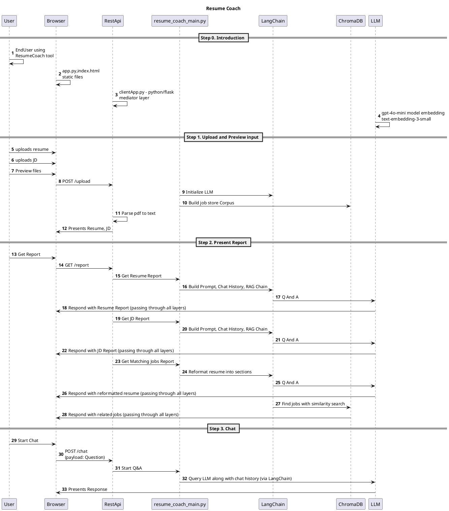

```plantuml
@startuml
autonumber
title Resume Coach

participant User as User
participant Browser
participant RestApi
participant resume_coach_main.py as ResumeCoach
participant LangChain
participant ChromaDB
participant LLM

== Step 0. Introduction ==

User -> User: EndUser using\nResumeCoach tool
Browser -> Browser: app.py,index.html\nstatic files
RestApi -> RestApi: clientApp.py - python/flask\nmediator layer
LLM -> LLM: gpt-4o-mini model embedding\ntext-embedding-3-small
== Step 1. Upload and Preview input ==

User -> Browser: uploads resume
User -> Browser: uploads JD
User -> Browser: Preview files

Browser -> RestApi: POST /upload
ResumeCoach -> LangChain: Initialize LLM
ResumeCoach -> ChromaDB: Build job store Corpus
RestApi -> RestApi: Parse pdf to text
RestApi -> Browser: Presents Resume, JD

== Step 2. Present Report ==

User -> Browser: Get Report
Browser -> RestApi: GET /report
RestApi -> ResumeCoach: Get Resume Report
ResumeCoach -> LangChain: Build Prompt, Chat History, RAG Chain
LangChain -> LLM: Q And A
LLM -> Browser: Respond with Resume Report (passing through all layers)
RestApi -> ResumeCoach: Get JD Report
ResumeCoach -> LangChain: Build Prompt, Chat History, RAG Chain
LangChain -> LLM: Q And A
LLM -> Browser: Respond with JD Report (passing through all layers)
RestApi -> ResumeCoach: Get Matching Jobs Report
ResumeCoach -> LangChain: Reformat resume into sections
LangChain -> LLM: Q And A
LLM -> Browser: Respond with reformatted resume (passing through all layers)
LangChain -> ChromaDB: Find jobs with similarity search
ChromaDB -> Browser: Respond with related jobs (passing through all layers)

== Step 3. Chat ==

User -> Browser: Start Chat
Browser -> RestApi: POST /chat\n(payload: Question)
RestApi -> ResumeCoach: Start Q&A
ResumeCoach -> LLM: Query LLM along with chat history (via LangChain)
LLM -> Browser: Presents Response

@enduml
```